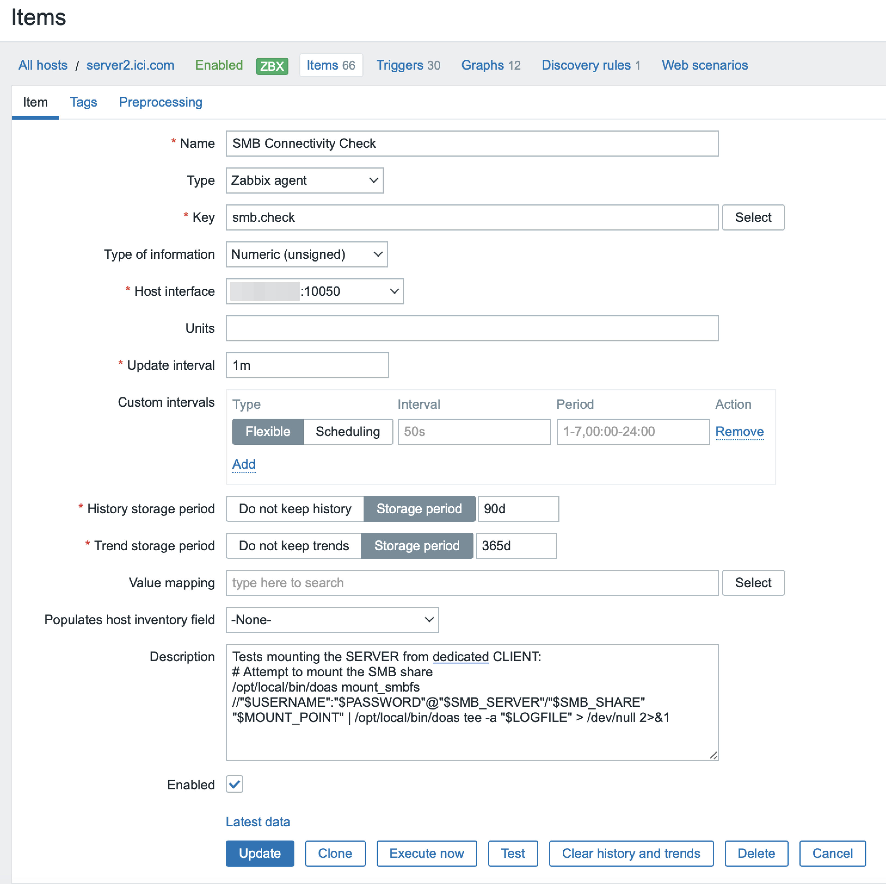
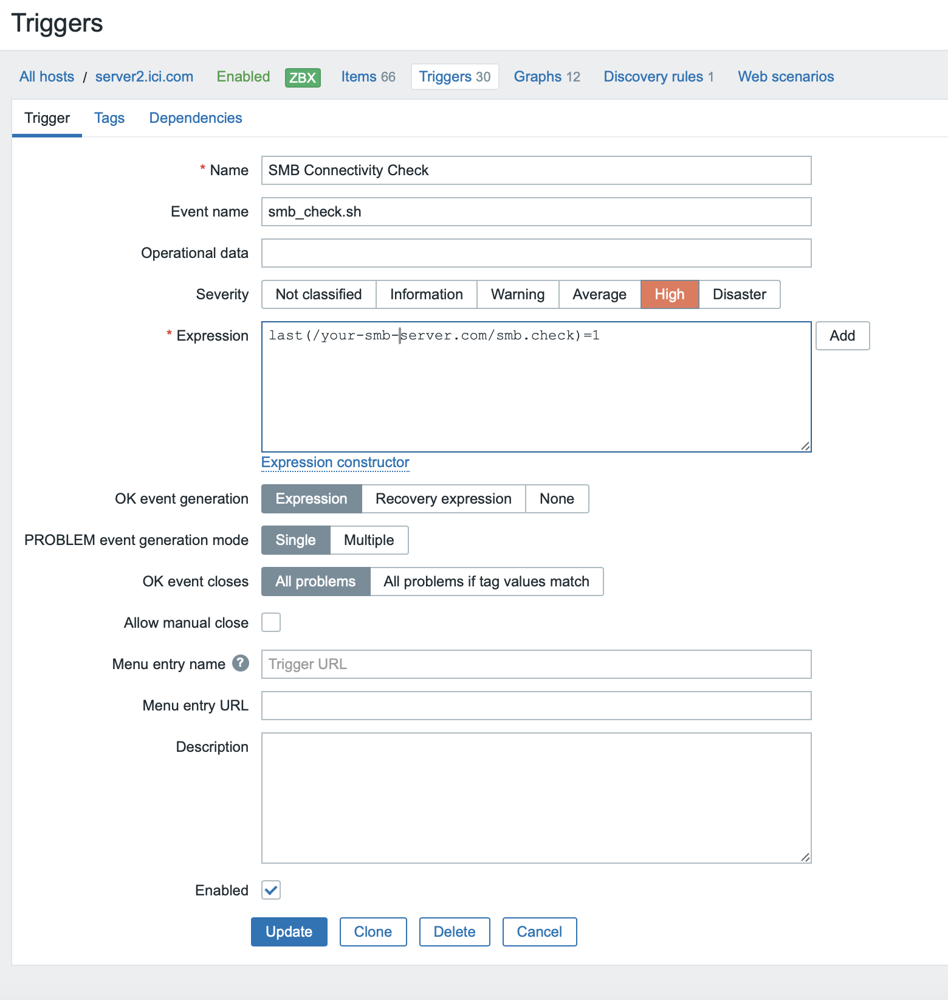

# smb_check

A script to verify if the macOS SMB service is running and ensure that clients can connect successfully. <s>The script uses doas, which I installed via MacPorts. However, since I also compiled it manually, MacPorts is optional if you prefer not to install it.</s>

## Features

- Checks the status of an SMB share by attempting to mount it on the system.
- Returns `0` on success and `1` on failure.

## Configuration

The script is configured with the following parameters:
- **SMB server address**: The address of the SMB server.
- **Share name**: The name of the SMB share to test.
- **Mount point**: The directory where the share will be mounted.
- **User credentials**: Credentials required to access the share.

Additional configuration includes:
- **Log files**: Locations for logging actions and errors (e.g., `/private/tmp/smb_test.log`).
- **Required commands**: Utilities like `mount_smbfs`, `umount`, and `doas`.

### Zabbix Integration

#### Script Location
Place the script at:
```
/usr/local/share/zabbix/externalscripts/smb_check.sh
```

#### Zabbix Agent Configuration
Add the following line to `/usr/local/etc/zabbix/zabbix_agentd.conf`:
```sh
UserParameter=smb.check,/usr/local/share/zabbix/externalscripts/smb_check.sh
```

### Log Files and Permissions

- Actions and errors are logged in `/private/tmp/smb_test.log` for debugging.
- The `doas` command ensures the script has necessary permissions for operations like:
  - Creating directories
  - Mounting/unmounting shares
  - Writing to log files

### Mounting and Unmounting SMB Shares

- **Mount Check**: Uses the `mount_smbfs` command to attempt to mount the SMB share. On success, it prints `0`.
- **Failure Handling**: If the mount fails (e.g., connectivity issues, invalid credentials), it prints `1`.

### File System Cleanup

- If the mount point is already in use, the script unmounts it before proceeding.
- Ensures the mount point directory is empty before attempting to mount the share.

## doas Permissions

The script requires the following `doas` configuration in `/opt/local/etc/doas.conf`:

```sh
# Explicit rules for Zabbix
permit nopass keepenv zabbix as root cmd /usr/bin/touch
permit nopass keepenv zabbix as root cmd /bin/chmod
permit nopass keepenv zabbix as root cmd /usr/bin/tee
permit nopass keepenv zabbix as root cmd /bin/mkdir
permit nopass keepenv zabbix as root cmd /bin/rm
permit nopass keepenv zabbix as root cmd /sbin/mount_smbfs
permit nopass keepenv zabbix as root cmd /sbin/umount
```

## Zabbix Integration Details

### Zabbix Item

This item monitors the SMB service status. Below is a screenshot of its configuration:



### Zabbix Trigger

The trigger alerts when the SMB service is unavailable. Below is a screenshot of its configuration:



---

### Example Output

When the script is executed:
- **Success**: Returns `0`
- **Failure**: Returns `1`
